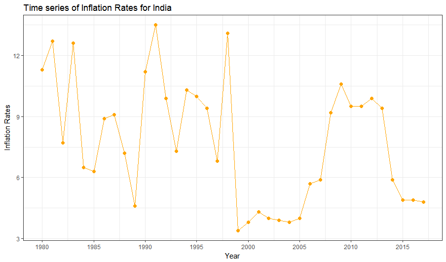

# Name: Ansh Pujara

# Reg. No.: 18BCE1103

# Aim:

This project aims at studying and analyzing the inflation rates of countries and major economic unions globally. The dataset is a public dataset downloaded from International Monetary Fund(IMF) which consists of the inflation rates of countries from 1980 to 2017 and the projected inflation rates of the countries till 2022.

# What is Inflation rate?

Inflation rates are the general rate at which price of the goods and services within a particular economy are rising and the **purchasing power** of the currency is declining due to the highly priced goods. High inflation is definately not good for an economy because it will always reduce the value for money. In general central banks of an ecomony tries to and work towards reducing the inflation rate and avoiding **deflation**. Very high inflation rates will devalue the country's currency and will result in further depreciation of currency's exchange value.



## Libraries

```{r}
library(readxl)
library(dplyr)
```

## Dataset Description

```{r}
data = read_excel("F:/eBooks/2020-21/WIN/EDA/Project/Inflation Analysis/inflation.xls")
head(data)
```

## Summary and Structure of Dataset

```{r}
str(data)
summary(data)
```

## Null Values

```{r}
cat("There are total", sum(is.na(na_if(data, "no data"))), "null values")
```

# Analysis and Prediction:

### The analysis of Inflation Rates will be done for some major emerging and developed countries individually and the prediction will be done using the three Time Series Model and an Ensemble of the three models:

1.  **Autoregressive Moving Average (ARMA)**

2.  **Autoregressive Integrated Moving Average (ARIMA)**

3.  **Facebook Prophet**

### The project was inspired by an old competition on Kaggle and the Models being used are not being used for the same project.
